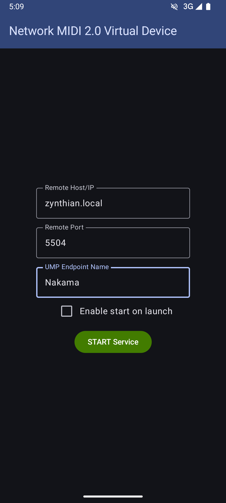
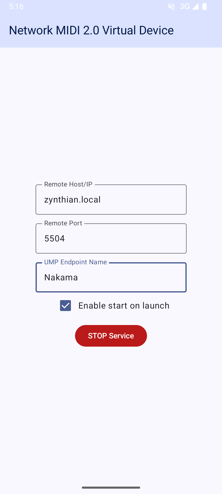

## About

This is an Android application that creates a **MIDI 1.0 virtual device**, and forwards the received events to/from a remote endpoint connected by **Network MIDI 2.0**. It allows you to setup the peer host/ip address, port and its own UMP endpoint name.

It should work on **Android 10** and newer versions.

It was developed to be used with [Zynthian](https://zynthian.org), but it can also work with whatever software you want. If you have any problem, open an issue in github. For any other feedback, please go to [Zynthian Discourse](https://discourse.zynthian.org/).

Dark Theme | Light Theme
:----:|:----:
 | 

> **NOTE**: The app may request for notification permissions. It will notify you only to **remind to start the service** (and connect to the remote peer), when the MIDI port is opened by another app. This software does not have ADs of any kind, nor collects any personal or usage data.

## Installation

Download the latest APK file in the [Releases Page](https://github.com/oscaracena/net-midi-vd/releases) and copy it to your Android device. There, follow the instructions to install.

## License

This software is (c) of Oscar Aceña 2024-2025. Released under the terms of GPL v3.

This software uses, among others, the following libraries:

* [BEBSDK](https://github.com/bbouchez/BEBSDK) (c) bbouchez under MIT License
* [NetUMP](https://github.com/bbouchez/NetUMP) (c) bbouchez under MIT License

## Useful References

* https://midi.org/network-midi-2-0
* https://developer.android.com/ndk/guides/audio/midi
* https://developer.android.com/reference/android/media/midi/package-summary
* https://github.com/android/ndk-samples/tree/main/native-midi
